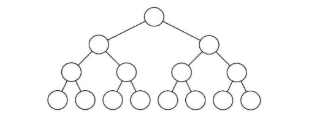
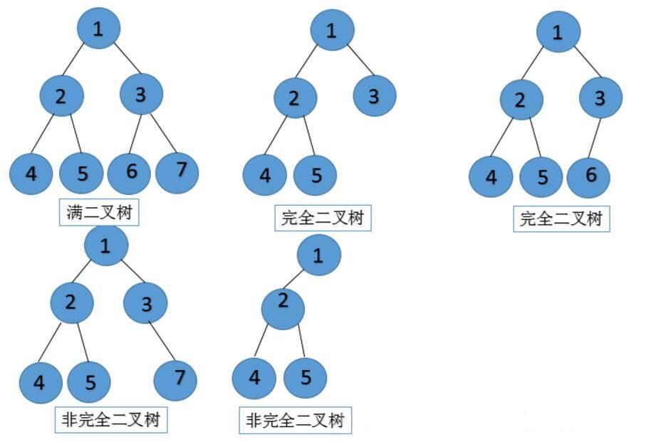
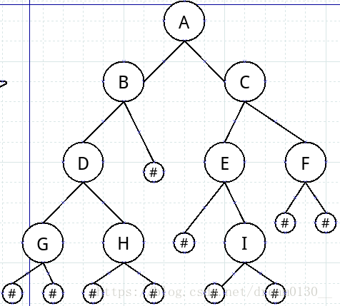

一、前沿概念：[树](/树.md)
> 参考资料：
> [蓝海人：二叉树、前序遍历、中序遍历、后序遍历](https://www.cnblogs.com/lanhaicode/p/10358736.html)、
> [二叉树的建立及其递归遍历（C语言实现)](https://blog.csdn.net/dream0130__/article/details/80779486)


# 二、二叉树
## 基本概念：
二叉树是一种非线性结构，二叉树是递归定义的，其结点有左右子树之分

## 二叉树的存储结构：
二叉树通常采用链式存储结构，存储结点由数据域和指针域（指针域：左指针域和右指针域）组成，二叉树的链式存储结构也称为二叉链表，对满二叉树和完全二叉树可按层次进行顺序存储

特点：

1. 每个结点最多有两颗子树
2. 左子树和右子树是有顺序的，次序不能颠倒
3. 即使某结点只有一个子树，也要区分左右子树
4. 二叉树可为空，空的二叉树没有结点，非空二叉树有且仅有一个根节点

二叉树中有两种特殊的二叉树：满二叉树、完全二叉树

**满二叉树**：二叉树中每个内部结点都有存在左子树和右子树（或者说满二叉树所有的叶结点都有同样的深度）
满二叉树一定是完全二叉树，但完全二叉树不一定是满二叉树

（满二叉树的严格的定义是：一颗深度为h且有2h-1个结点的二叉树）


（图片来源：https://www.cnblogs.com/polly333/p/4740355.html）

## 完全二叉树：
第一种解释：如果一颗二叉树除最右边位置上有一个或几个叶结点缺少外，其他是丰满的那么这样的二叉树就是完全二叉树（这句话不太好理解），看下面第二种解释

第二种解释：除第h层外，其他各层（1到h-1）的结点数都达到最大个数，第h层从右向左连续缺若干结点，则这个二叉树就是完全二叉树

也就是说如果一个结点有右子结点，那么它一定也有左子结点

第三种解释：除最后一层外，每一层上的节点数均达到最大值，在最后一层上只缺少右边的若干结点

完全二叉树的形状类似于下图


为了方便理解请看下图（个人理解：完全二叉树就是从上往下填结点，从左往右填，填满了一层再填下一层）



二叉树相关词语解释：
## 结点的度
结点拥有的子树的数目

## 叶子结点
度为0的结点（tips：在任意一个二叉树中，度为0的叶子结点总是比度为2的结点多一个）

## 分支结点
度不为0的结点

## 树的度
树中结点的最大的度

## 层次
根结点的层次为1，其余结点的层次等于该结点的双亲结点的层次加1

## 树的高度
树中结点的最大层次

## 二叉树基本性质：
性质1：在二叉树的第k层上至多有2k-1个结点（k>=1）

性质2：在深度为m的二叉树至多有2m-1个结点

性质3：对任意一颗二叉树，度为0的结点（即叶子结点）总是比度为2的结点多一个

性质4：具有n个结点的完全二叉树的深度至少为[log2n]+1，其中[log2n]表示log2n的整数部分

存储方式

存储的方式和图一样，有链表和数组两种，用数组存访问速度快，但插入、删除节点操作就比较费时了。实际中更多的是用链来表示二叉树（下面的实现代码使用的是链表）

实现代码：

``` c++
#include <stdio.h>
#include <stdlib.h>
#define N 10

typedef struct node
{
    char data;
    struct node *lchild;    /* 左子树 */
    struct node *rchild;    /* 右子树 */

}BiTNode, *BiTree;

void CreatBiTree (BiTree *T) /* BiTree *T等价于 struct node **T    */
{
    char ch;

    scanf("%c", &ch);
	getchar(); /* 接收scanf输入的回车*/

    if (ch == '#')    /* 当遇到#时，令树的结点为NULL，从而结束该分支的递归 */
    {
        *T = NULL;
    }
    else
    {
        *T = (BiTree)malloc(sizeof(BiTNode));
        if (*T == NULL)
        {
            printf("内存分配失败");
            exit(0);
        }
        (*T)->data = ch;        /* 生成结点 */
        CreatBiTree(&(*T)->lchild);    /* 构造左子树 */
        CreatBiTree(&(*T)->rchild);    /* 构造右子树 */
        /* 这里需要注意的是->的优先级比&高，所以&(*T)->lchild得到的是lchild的地址 */
    }

}
int main()
{
    int level  = 1;

    BiTree t = NULL;
    printf("以前序遍历方式输入二叉树\n");
    CreatBiTree(&t);    /* 传入指针的地址 */
}
```

# 实例

使用上面代码生成如下图二叉树

 
 
使用上面代码，依次输入如下字符（也就是加上“#”的[前序数列](../适用场景/二叉树的遍历.md)）

``` c++
 A
 B
 D
 G
 #
 #
 H
 #
 #
 #
 C
 E
 #
 I
 #
 #
 F
 #
 #
 ```